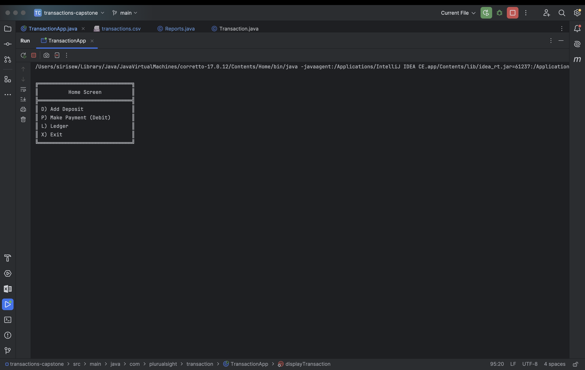
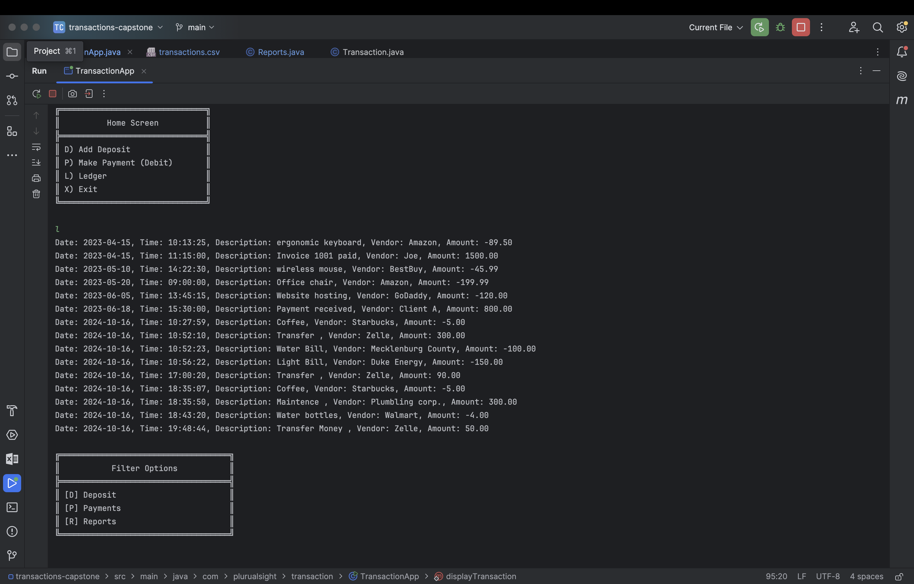
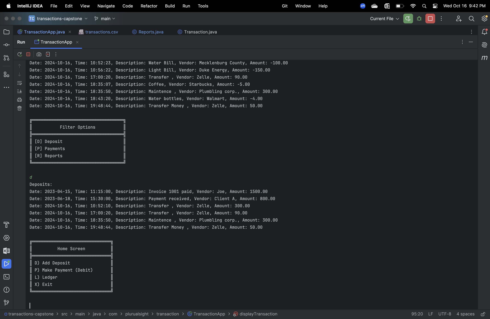
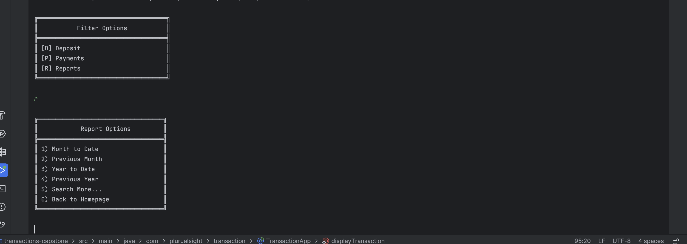
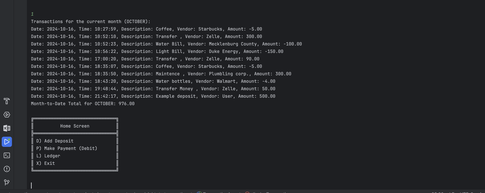
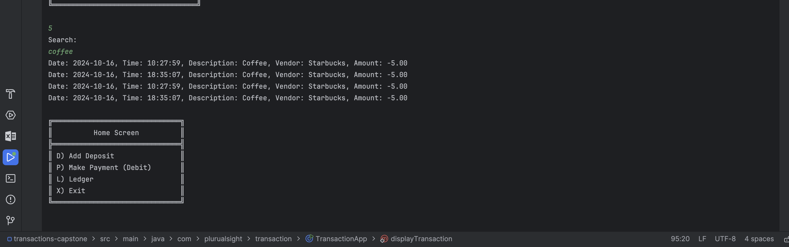
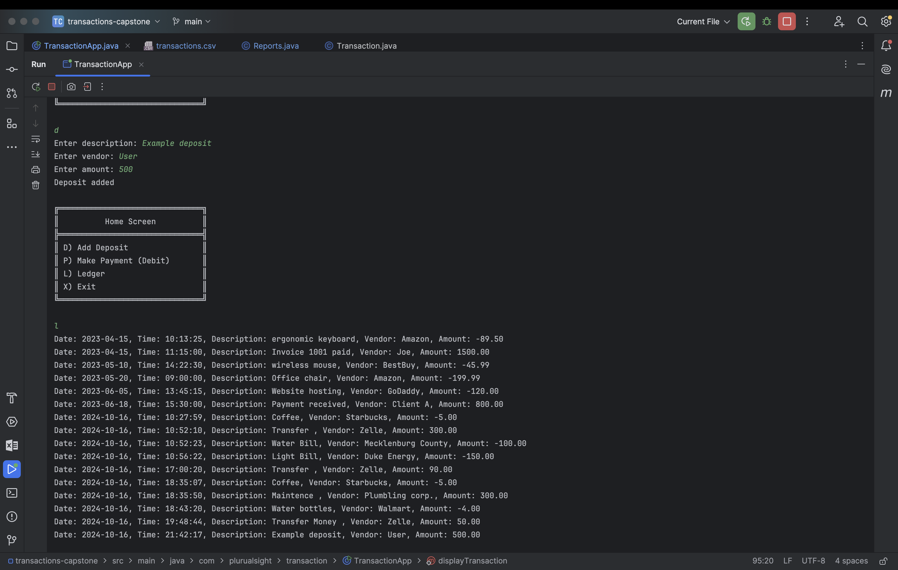

# Transaction Capstone

## About 
The application allows for user to have access of the ledger which will have a list of transactions with 
date, time, the description and vendor and also how much money is taken or added.
The user will run the TransactionApp. It will list prompt allowing the user to add either a
payment or deposit. Also, will have the ledger available to view. This will allow user to 
filter their search and have access to either just payments or deposit, even access their 
search by date. 

## Features

- **Add Deposits**: Users can record positive amounts (deposits).
- **Make Payments**: Users can record negative amounts (payments).
- **View Ledger**: Users can display all transactions, or filter by deposits and payments.
- **Reports**: Generate reports based on transaction dates.

## Java Classes
- `TransactionApp.java`: The main class that will run the program.
- `Reports.java`: Generate the report based on specific search 
- `Transaction.java`: Serves as blueprint for creating transaction objects

## User interface
#### Home screen
The first prompt that the user will view.

If user input is L or l the console will print out all transaction.

Once the user is displayed the transaction, the program will then prompt the user if they would like to filter the transaction 
by deposit or payments.

They are also allowed to see the reports. When user input r they will be able to view more in depth.
They can access current or previous months, current year or previous year and then be allowed to search for more.

If user input is 1 or month to date.

If user input is 5 to be able to search more, they will be able to search for the transaction with dates, vendor, amount.

Back to the home page the user is also able to add a deposit.
Which will update the transaction file, and be able to see the new object added when wanting to display the ledger again.

## Conclusion 
The Transaction Capstone application is designed to provide a simple yet powerful tool for managing personal finances. With its intuitive interface and robust features, users can easily track their transactions and generate useful reports.
I can improve more on the user interface and clean the code add more classes. 

